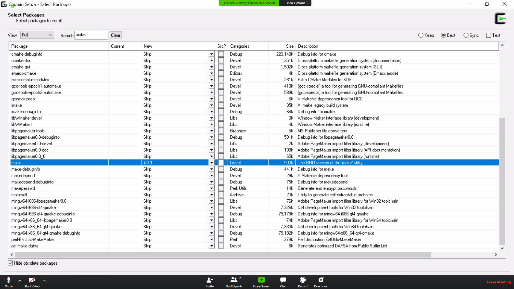
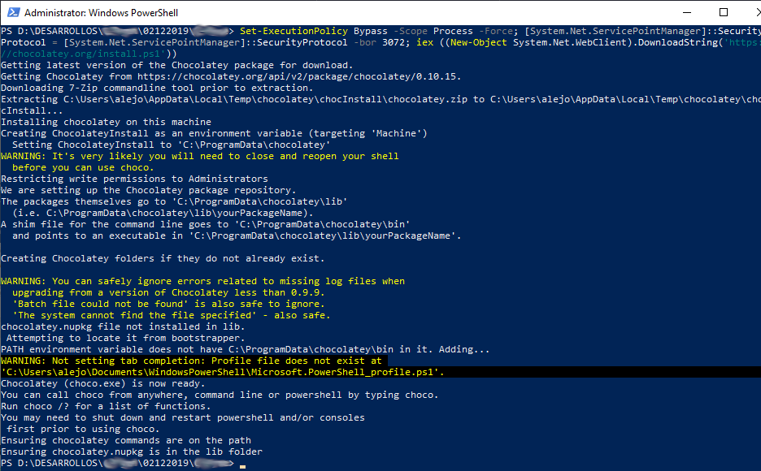
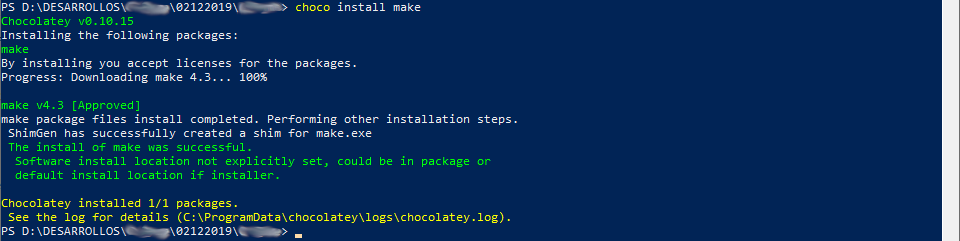
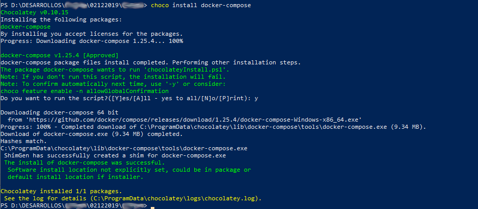

# Django Microservices
Based on [Django REST framework + OAuth](https://github.com/diegoug/Django-REST-framework-OAuth)

Django Basic Configuration to create micro services based on this Framework

## Index
* [Dependencies](#dependencies)
	* [Linux](#Linux)
	* [Windows](#Windows)
* [Creating key SSH](#key-ssh)
* [Download main repository](#download-main-repository)
* [Clone Repositories](#clone-repositories)
* [Commands to work with docker](#commands-to-work-with-docker)
	* [Create Network](#create-the-network)
	* [Install dependencies](#install-dependencies)
	* [Init containers](#start-development)
	* [Stop Containers](#stop-development)

## Dependencies

### Linux

To start to work with docker, we need install docker and docker composer as a primary step, in versions that can work with the YAML compose configuration file in version two.

- https://docs.docker.com/engine/installation/#time-based-release-schedule
- https://docs.docker.com/compose/install/
- https://docs.docker.com/compose/compose-file/compose-file-v2/#blkio_config


### **Windows**

First, to use docker in windows you must have windows 10 pro or higher, but always pro, or windows server or enterprise. Next, is to download and install the docker installer (https://docs.docker.com/docker-for-windows/install/).

Make sure you install the linux containers.

After is installed, from the Windows PowerShell, we test with the following command and should receive the version of docker:

`docker --version`

#### **Cygwing**
cygwin is a Linux-like open source project package manager for use on windows.

Now, to be able to use the make command and the other regular commands such as cp, pwd etc, we install Cygwin that can be download from (a terminal with the linux functions but on windows):

- https://cygwin.com/install.html

**NOTE 1:** In the configuration and downloading page search and select the make command with changing skip option to the version required that is '4.3-1' and should look like the following:



**NOTE 2:** In case the commands installed are shwon in the bin folder but can not be called from bash or mintty we need to add the route to the bin folder, where are located the commands, and include in the PATH variable of the system.

**NOTE 3:** In case you need to install another package using Cygwing it is necessary to run the setup again to show you the package manager.

**NOTE 4:** To use the Cygwin terminal in VSCode it is necessary to have the following configuration in the settings.json

```JSON
{
    "editor.rulers": [79, 90],
    "terminal.integrated.shell.windows": "C:\\cygwin64\\bin\\bash.exe",
    "terminal.integrated.env.windows": {
        "CHERE_INVOKING": "1"
    },
    "terminal.integrated.shellArgs.windows": [
        "--login",
        "-i"
    ],
    "explorer.confirmDelete": false,
    "explorer.confirmDragAndDrop": false,
}
```

#### **Option 2** (Not Recommended)

Now, to install the make command, that is the main command used in windows we have to download and install Chocolatey (https://chocolatey.org/install) through the following command in the Windows PowerShell as admin mode:

`Set-ExecutionPolicy Bypass -Scope Process -Force; [System.Net.ServicePointManager]::SecurityProtocol = [System.Net.ServicePointManager]::SecurityProtocol -bor 3072; iex ((New-Object System.Net.WebClient).DownloadString('https://chocolatey.org/install.ps1'))`

we should see something like the following:



After is installed chocolatey, we proceed to install the make command running the following instruction:

`choco install make`

we should see something like the following:



Also is needed the docker-compose command that is installed through:

`choco install docker-compose`

we should see something like the following:



**NOTE:** select your system operative for download version of docker.

## Key SSH

### Linux SSH

First step is generate a new ssh key in the next link we found the steps to follow for the new ssh key:

- https://help.github.com/articles/generating-a-new-ssh-key-and-adding-it-to-the-ssh-agent/

Now we going to configurate our ssh key, with our logged in user go to the following link:

- https://github.com/settings/keys

in the following link we find the steps to copy our ssh and configure it in the previous link view:

- https://help.github.com/articles/adding-a-new-ssh-key-to-your-github-account/

## Download main repository

### Linux Repository

to download the repository, only need run the next command:

`git clone git@github.com:diegoug/Django-REST-framework-OAuth.git`

### Windows Repository

Incase of windows is recommended to donwload and install GitHub desktop that allows you to select and manage the sync from local to/from the repository, it can be downloaded from:

- https://help.github.com/es/desktop/getting-started-with-github-desktop/installing-github-desktop

And is require only to login as in the web page.

### commands to work with docker

Now we need run the next commands in order.


* [Create the network](#create-the-network)
* [Install dependencies](#install-dependecies)
* [Start proyects](#star-development)
* [Stop proyects](#stop-development)

### create the network

`$ make create-network`

### Install dependencies

`$ make build-development`

### Start development

`$ make start-development`

### Stop development

`$ make stop-development`
